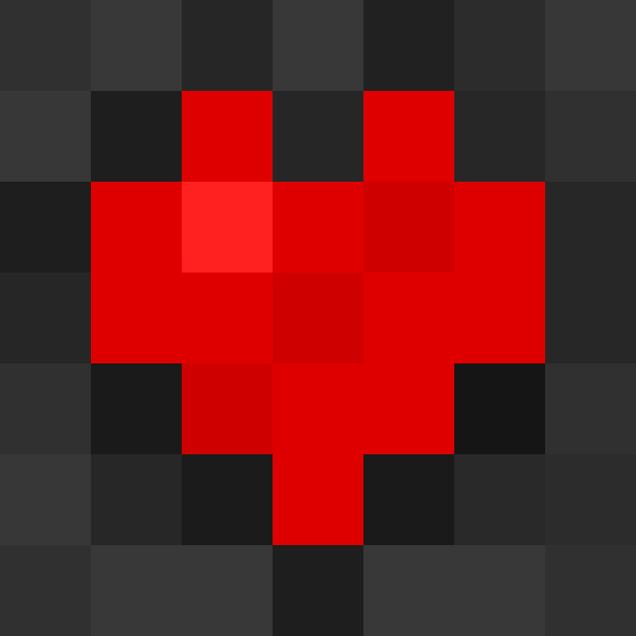
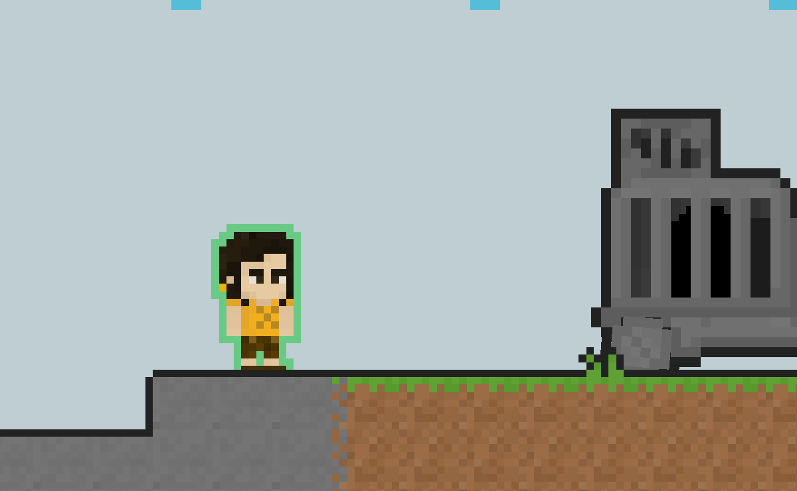
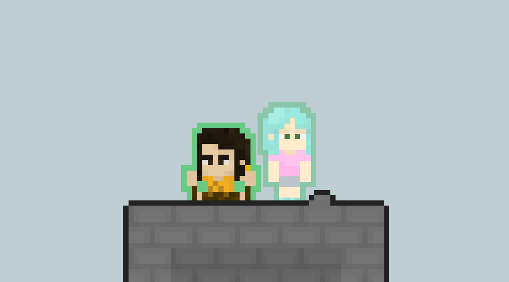
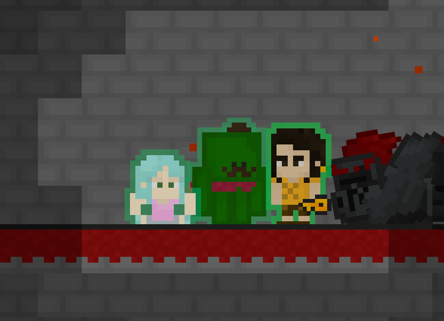

#  Adrio

**Adrio** — захватывающий 2D-платформер с уникальными персонажами и глубокой системой персонализации. Исследуйте разнообразные уровни, стройте стратегии, управляйте героями и используйте их особые способности!

<p align="center">
  
</p>

## 🚀 Особенности

- **🎭 3 уникальных персонажа** с особыми способностями
- **🌍 7 основных уровней** с врагами и препятствиями
- **🎨 Система персонализации** с различными предметами
- **🌐 Поддержка языков:** Русский и Английский
- **🎵 3 музыкальные темы** в главном меню
- **⚙️ Гибкие настройки** звука и музыки

## 🎮 Управление

| Действие | Основные клавиши | Альтернативные клавиши |
|:---------|:-----------------|:-----------------------|
| **Движение влево** | `A` | `◄ Left Arrow` |
| **Движение вправо** | `D` | `► Right Arrow` |
| **Прыжок** | `W` / `Space` | `▲ Up Arrow` |
| **Присесть** | `S` | `▼ Down Arrow` |
| **Выбор Стюарта** | `Z` | |
| **Выбор Дженни** | `X` | |
| **Выбор Чокипи** | `C` | |

## 👥 Персонажи

## Stuart
- **📦** Доступен с начала игры
- **⚡** Способен совершить рывок (двойной прыжок)
###  

## Jenny
- **📦** Открывается после 4 уровня
- **⚡** Умеет взбираться по стенам
###  

## Chockipie
- **📦** Доступен после финального уровня
- **⚡** Уменьшается в размерах, чтобы пролезть в узкие щели
###  

## ⚙️ Настройки

В меню настроек доступно:
- **🌐 Выбор языка** (Русский/Английский)
- **🔊 Регулировка громкости** звуков и музыки
- **🎶 Смена музыкальной темы** в меню
- **👕 Система персонализации** персонажей

## 📦 Тестирование

1. Склонировать репозиторий: 
  ```bash
  git clone https://github.com/grandfrog0/Adrio.git
2. Откройте проект в Unity (рекомендуемая версия: 2022.3.55f1).
3. Выберите сцену MainMenu и запустите её.

## 🛠️ Разработка

Игра разработана на **Unity**. Разработчик: **GrandFrog**.

## 📄 Лицензия

Все права защищены. Графика, звуки и музыка являются собственностью автора.